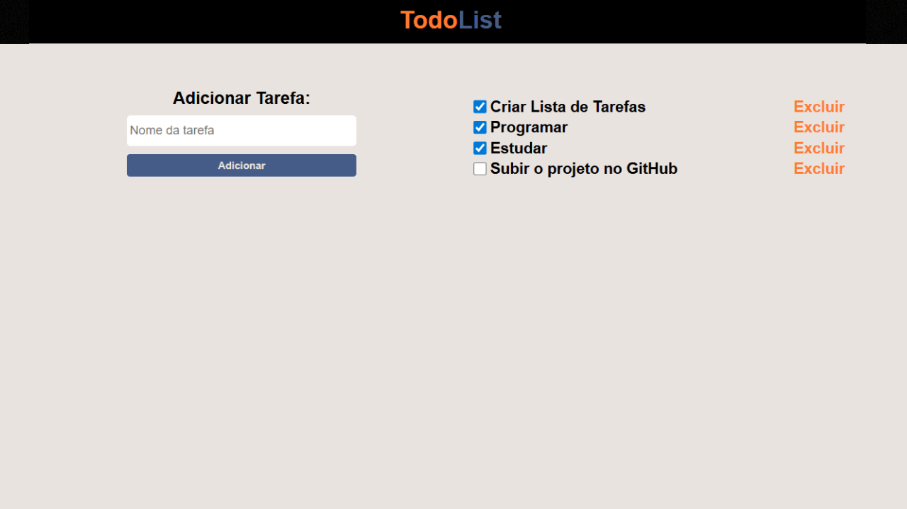

# ✅ Lista de Tarefas (TodoList)


## Sobre o projeto

A **Lista de Tarefas (TodoList)** é um projeto simples desenvolvido com **HTML**, **CSS** e **JavaScript puro**, com o objetivo principal de **praticar e fixar conceitos fundamentais do JavaScript**.

O projeto permite **adicionar**, **excluir** e **marcar tarefas como concluídas**, além de utilizar o **localStorage** para salvar as tarefas, garantindo que elas permaneçam salvas mesmo após atualizar ou fechar o navegador.

> Projeto focado em aprendizado, lógica de programação e manipulação do DOM.

---

## Layout

<p align="center">
  
</p>

> Interface simples e funcional, com foco total na prática do JavaScript.

---

## ⚙️ Tecnologias utilizadas

O projeto foi desenvolvido com as seguintes tecnologias:

* **HTML5** — Estrutura da aplicação
* **CSS3** — Estilização simples e responsiva
* **JavaScript** — Lógica da aplicação, manipulação do DOM e armazenamento no localStorage

---

## 🔒 Funcionalidades

* Adicionar novas tarefas
* Excluir tarefas individualmente
* Marcar tarefas como concluídas (checkbox)
* Validação para impedir tarefas vazias
* Salvamento automático das tarefas no **localStorage**
* As tarefas permanecem salvas até serem excluídas pelo usuário

---

## Conceitos de JavaScript praticados

Durante o desenvolvimento do projeto, foram utilizados diversos conceitos importantes do JavaScript, como:

* Manipulação do **DOM** (`querySelector`, `createElement`, `appendChild`)
* Uso de **arrays** para controle das tarefas
* Métodos de array (`map`, `push`, `splice`)
* **Eventos** (`onclick`)
* **LocalStorage** para persistência de dados
* Conversão de dados com `JSON.parse` e `JSON.stringify`
* Validação de input (`trim`)

---

## 🧭 Como rodar o projeto

### Pré-requisitos

* Navegador web atualizado
* Editor de código (VS Code recomendado)

### 📥 Clonando o repositório

```bash
git clone https://github.com/jotavitorz/todo-list.git
```

### ▶️ Executando o projeto

Basta abrir o arquivo **`index.html`** no navegador.

Não é necessário instalar dependências ou rodar servidor.

---

## 📂 Estrutura do projeto

```bash
📁 lista-de-tarefas
 ├── 📁 images
 │    └── preview-project.png
 ├── index.html
 ├── style.css
 ├── script.js
 └── README.md
```

## 🤝 Contribuições

Este é um projeto de estudo, mas sinta-se à vontade para:

* Melhorar o layout
* Adicionar novas funcionalidades
* Refatorar o código
* Implementar filtros ou edição de tarefas

### Observações

> Projeto desenvolvido exclusivamente para **prática e aprendizado**.
> Código simples e didático, focado em entender o funcionamento do JavaScript na prática.
---
<p align="center">Feito por <b>João Vitor</b> 💻</p>
